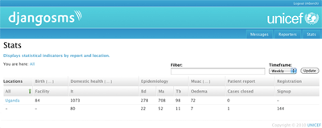

Overview
========

DjangoSMS is an open-source SMS application server licensed
under the BSD license.

The system is written in `Python <http://www.python.org>`_ for the
`Django <http://www.djangoproject.com>`_ web framework.

Originally developed by UNICEF Uganda for a mobile health project,
this project started as a branch of the `RapidSMS
<http://www.rapidsms.org>`_ project and shares project goals and
ambitions. While many of the user interface elements are adapted from
RapidSMS, the platform is a complete redesign, with all code written
from scratch including all database models.

   *The statistics page with aggregated reports*

Who's It For
------------

While the SMS protocol itself is simple and to be considered as known
territory (ponte factum, caesar transit), the DjangoSMS platform
helps connect the dots and comes with *batteries included*.

* Message records
* Support for user training
* User registration
* Drill-down statistics

Introduction
------------

From *ingress* to *egress*, the DjangoSMS platform tries to provide
sensible abstraction points for parsing, handling and responding to
SMS messages.

Messages enter the system through one or more :term:`transports
<transport>`, then routed to zero or more :term:`requests
<request>`. Each request handler may return a message :term:`reply`
and optionally send additional :term:`responses <response>` to other
recipients:

 Transport → Incoming → Request(s) → Response(s) → Outgoing → Transport

This is supported by a rich web user interface and apps that extend
the core functionality to provide functionality such as *reporting*
and *statistics*.

Example
-------

Let's write an application that echoes back the text you enter. We
will require an input on the following format:

  *+ echo < text >*

To map this input to application logic we add an entry into the
routing table. We use regular expressions to spell this mapping, but
since for this particular message syntax -- :term:`keyword route
<keyword>` -- a helper function is available, we'll make use of it:

.. code-block:: python

   # produces the regex pattern: ^\+\s*echo(\s+(?P<text>[^\+]*)|$)
   from djangosms.core.patterns import keyword
   pattern = keyword('echo')

Note that the generated regular expression puts the input text into
the ``"text"`` group (see the Python documentation for the `re
<http://docs.python.org/library/re.html#re.RegexObject.groups>`_
module). This is necessary for the message handler to know what the
message input is (by convention). The :data:`keyword
<djangosms.core.patterns.keyword>` helper function takes a subpattern
which defines the keyword string that succeeds the default``"+"``
symbol (prefix character) and optional whitespace (more configuration
options are available).

The routing table is defined globally in the Django settings module
under the ``ROUTES`` attribute. Each entry consists of a regular
expression and a callable that takes a :class:`request
<djangosms.core.models.Request>` and keyword arguments as returned by
the regular expression match dictionary. If the callable returns a
string, it's used as the message reply. An input error is signaled by
raising a :class:`FormatError <djangosms.core.router.FormatError>`
(this short-circuits any further processing):

.. code-block:: python

  from djangosms.core.router import FormatError

  def echo(request, text=None):
      if not text:
          raise FormatError(u"No input received.")

      return text

  ROUTES = (
      (pattern, echo),
      )

That's the first version of our example application!

It's also the *simple* configuration.

Instead of providing a callable to handle the form input, we can
provide a subclass of :class:`Form
<djangosms.core.models.Form>`. This is an abstraction layer that
allows us to split up parsing and handling into separate stages:

.. code-block:: python

   from djangosms.core.router import Form

   class Echo(Form):
       def parse(self, text=None):
           if not text:
              raise FormatError(u"No input received.")

           return {
               'text': text,
               }

       def handle(self, text=None):
           return text

   ROUTES = (
       (pattern, Echo),
       )

.. add these routes to the setup

  >>> routes.extend(ROUTES)

The entry into the routing table is the same except that we replaced
our ``echo`` function with a subclass of :class:`Form
<djangosms.core.router.Form>`. The responsibility and interface of
each of the ``parse`` and ``handle`` methods is described in detail in
the section on :ref:`class-based routes <class-based routes>`.

Trying it out
-------------

We could now try and send a text message that matches our form.

.. code-block:: python

  incoming = connection.route("+echo Hello world!")

Incoming messages are stored in the
:class:`djangosms.core.models.Incoming` model. The message we sent was
routed to one request:

  >>> incoming.requests.count()
  1

The input text for that request was the entire message body:

  >>> request = incoming.requests.get()
  >>> request.text
  u'+echo Hello world!'

The reply is recorded as a *message response* in the :data:`response
<djangosms.core.models.Form.response>` attribute.

  >>> request.responses.count()
  1
  >>> print request.responses.get()
  Hello world!

There can be other responses to a message; these could be *alerts* or
*notifications*. Such logic is usually carried out in the message
handler (or at a later time)::

  def handle(self, text=None):
      self.respond(some_connection, "Got message: %s." % text)

The :class:`connection <djangosms.core.models.Connection>` argument
tells the system where to send the response.

Testing
-------

The system includes an automated test suite. It requires the `nose
<http://somethingaboutorange.com/mrl/projects/nose>`_ testing library
with the `django-nose <http://pypi.python.org/pypi/django-nose>`_
command extension.

Running all tests::

  $ easy_install django-nose
  $ python manage.py test

See the API documentation on :ref:`testing <testing>` for more information.

Contribution
------------

If you find this software useful, please feel welcome and encouraged
to contribute with bug fixes, documentation or new features.

The ``master`` branch of the ``core`` respository is the main
development focus. For a change or feature to merged into this branch,
test coverage must not degrade. We also ask that all changes and
features are documented.

GitHub project: `http://github.com/djangosms
<http://github.com/djangosms>`_

Documentation
-------------

To build the documentation outputs (HTML and PDF formats)::

  $ make html
  $ make latex
  $ cd build/latex
  $ make all-pdf

License
-------

This software is made available as-is under the BSD license.

Contents
========

.. toctree::
   :numbered:
   :maxdepth: 2

   getting_started.rst
   messages.rst
   running.rst
   apps.rst
   api.rst
   faq.rst
   glossary.rst

Indices and tables
==================

* :ref:`search`
* :ref:`glossary`

